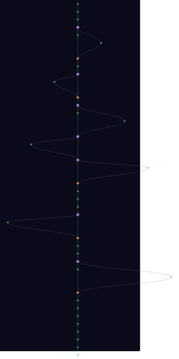

# design-tools

<!-- Project Shields/Badges -->
<p align="center">
  <a href="https://github.com/XAOSTECH/design-tools">
    
  </a>
  <a href="https://github.com/XAOSTECH/design-tools/releases">
    
  </a>
  <a href="https://github.com/XAOSTECH/design-tools/blob/main/LICENSE">
    
  </a>
</p>

<p align="center">
  <a href="https://github.com/XAOSTECH/design-tools/actions">
    
  </a>
  <a href="https://github.com/XAOSTECH/design-tools/issues">
    
  </a>
  <a href="https://github.com/XAOSTECH/design-tools/pulls">
    
  </a>
  <a href="https://github.com/XAOSTECH/design-tools/stargazers">
    
  </a>
  <a href="https://github.com/XAOSTECH/design-tools/network/members">
    
  </a>
</p>

<p align="center">
  
  
  
  
</p>

<!-- Optional: Stability/Maturity Badge -->
<p align="center">
  
  
</p>

---

<p align="center">
  <b>Unix Design Toolset</b>
</p>

---

## 📋 Table of Contents

- [Overview](#-overview)
- [Features](#-features)
- [Installation](#-installation)
- [Usage](#-usage)
- [Configuration](#-configuration)
- [Documentation](#-documentation)
- [Contributing](#-contributing)
- [Roadmap](#-roadmap)
- [Support](#-support)
- [License](#-license)
- [Acknowledgements](#-acknowledgements)

---

## 🔍 Overview

**design-tools** is a monorepo containing modular design automation tools and workflows for Unix-like systems. It brings together various design-related projects into a unified ecosystem.

### Monorepo Structure

```
design-tools/
├── design-flows/     # Automated design workflow scripts
│   └── flows/
│       └── vsGen/    # VS Code theme generator
├── themes/           # Theme collections and frameworks
│   └── GTK/          # GTK theme configurations
└── docs/             # Shared documentation
```

### Why design-tools?

Design workflows often require multiple tools working together. This monorepo provides:

- **Unified workflow** — All tools in one place with consistent interfaces
- **Modular architecture** — Each tool is self-contained and can be used standalone
- **Automated design** — Scripts that eliminate repetitive design tasks
- **Open source** — Community-driven development with UK English spelling

---

## ✨ Features

- 🎨 **vsGen** - VS Code workspace theme generator with intelligent colour palette expansion
- 🌈 **Colour Workflows** - WCAG-compliant colour generation with accessibility protection
- 🖌️ **Theme Collections** - GTK themes and system-wide appearance configurations
- 🔧 **Modular Libraries** - Reusable Bash libraries for colour manipulation
- 📦 **Auto-Install** - Dependencies fetched and installed automatically
- 🇬🇧 **UK English** - Proper spelling throughout (colour, not color)

---

## 📥 Installation

### Prerequisites

- Bash 5.0+
- Git with submodule support
- [pastel](https://github.com/sharkdp/pastel) (auto-installed by vsGen if missing)

### Clone with Submodules

```bash
# Clone the entire monorepo
git clone --recursive https://github.com/XAOSTECH/design-tools.git
cd design-tools

# Or if already cloned without --recursive
git submodule update --init --recursive
```

### Individual Subprojects

Each subproject can be cloned standalone:

```bash
# design-flows only
git clone https://github.com/XAOSTECH/design-flows.git

# themes only
git clone https://github.com/XAOSTECH/themes.git
```

---

## 🚀 Usage

### vsGen — VS Code Theme Generator

```bash
cd design-flows/flows/vsGen

# Use a built-in preset
./src/vsGen --preset sakura

# Custom colour combinations
./src/vsGen -p coral -s gold -t skyblue --compl

# High variation with preview
./src/vsGen -p "#ff1493" -s "#ffd700" --variation 0.8 --dry-run

# List all presets
./src/vsGen --list-presets
```

### GTK Themes

```bash
cd themes/GTK
# Follow theme-specific installation instructions
```

### Examples

<details>
<summary>📘 Example 1: Create Custom VS Code Theme</summary>

```bash
cd design-flows/flows/vsGen
./src/vsGen -p violet -s lime -t cyan -n "My Theme" --compl
```

Opens in VS Code: `./out/My-Theme-2026-03-05-v1.1.0.code-workspace`

</details>

<details>
<summary>📗 Example 2: Update Existing Workspace</summary>

```bash
./src/vsGen -c project.code-workspace -p coral -s gold --variation 0.8
```

Updates colour customisations while preserving folder structure.

</details>

<details>
<summary>📙 Example 3: Preview Theme Before Writing</summary>

```bash
./src/vsGen --preset neon --dry-run -v
```

Shows colour palette preview with WCAG contrast checks.

</details>

---

## ⚙️ Configuration

### vsGen Configuration

vsGen accepts configuration via command-line flags:

| Option | Description | Default |
|--------|-------------|---------|
| `--primary <COLOUR>` | Primary colour | `pink` |
| `--secondary <COLOUR>` | Secondary colour | `yellow` |
| `--tertiary <COLOUR>` | Tertiary colour | `lavender` |
| `--variation <0-1>` | Colour variation level | `0.5` |
| `--bg-lightness <0-1>` | Background darkness | `0.12` |
| `--compl` | Generate complementary colours | disabled |

### Environment Variables

vsGen will auto-install dependencies if missing. Manual installation:

```bash
# Install pastel CLI
cargo install pastel
# or download from https://github.com/sharkdp/pastel/releases
```

---

## 📚 Documentation

### Monorepo Documentation

| Document | Location | Description |
|----------|----------|-------------|
| [📖 Monorepo README](../README.md) | Root | Main monorepo documentation |
| [📚 This Document](docs/README.md) | docs/ | Detailed documentation |
| [⚖️ License](../LICENSE) | Root | GPL-3.0 License |

### Subproject Documentation

| Project | Documentation | Description |
|---------|---------------|-------------|
| **design-flows** | [README](../design-flows/README.md) | Workflow collection overview |
| **vsGen** | [README](../design-flows/flows/vsGen/README.md) | VS Code theme generator |
| **themes** | [README](../themes/README.md) | GTK themes and configs |

---

## 🤝 Contributing

Contributions are welcome! Each subproject has its own contributing guidelines:

- [design-flows/CONTRIBUTING.md](../design-flows/CONTRIBUTING.md)
- [themes/CONTRIBUTING.md](../themes/CONTRIBUTING.md)

### Monorepo Workflow

1. **Fork** the repository
2. **Clone with submodules**: `git clone --recursive <your-fork>`
3. **Create feature branch**: `git checkout -b feature/amazing-feature`
4. **Make changes** in the appropriate submodule
5. **Commit** with [conventional commits](https://www.conventionalcommits.org/):
   ```bash
   git commit -m "feat(vsGen): add new colour preset"
   ```
6. **Push** and open a Pull Request

### Submodule Development

```bash
# Work in a submodule
cd design-flows
git checkout -b feature/new-flow

# Make changes and commit
git add .
git commit -m "feat: add new flow"
git push origin feature/new-flow

# Update monorepo reference
cd ..
git add design-flows
git commit -m "chore: update design-flows submodule"
```

See also: [Code of Conduct](../CODE_OF_CONDUCT.md) | [Security Policy](../SECURITY.md)

---

## 🗺️ Roadmap

### Completed

- [x] vsGen — VS Code theme generator
- [x] Modular library architecture
- [x] WCAG contrast protection
- [x] 8 built-in colour presets
- [x] Auto-install dependencies
- [x] UK English throughout

### Planned

- [ ] Additional workflows (icon theme generator, terminal theme generator)
- [ ] Web-based colour picker UI
- [ ] VS Code extension wrapper
- [ ] CI/CD pipeline for theme validation
- [ ] Colour palette export formats (ASE, ACO, GPL)

See the [open issues](https://github.com/XAOSTECH/design-tools/issues) for proposed features and known issues.

---

## 💬 Support

- � **Issues**: [GitHub Issues](https://github.com/XAOSTECH/design-tools/issues)
- 💬 **Discussions**: [GitHub Discussions](https://github.com/XAOSTECH/design-tools/discussions)
- 📖 **Documentation**: [xaostech.github.io/design-tools](https://xaostech.github.io/design-tools)
- 🐛 **Bug Reports**: Use issue templates for bug reports
- ✨ **Feature Requests**: Open a discussion or issue

---

## 📄 License

Distributed under the GPL-3.0 License. See [`LICENSE`](../LICENSE) for more information.

---

## 🙏 Acknowledgements

- [pastel](https://github.com/sharkdp/pastel) — Colour manipulation CLI by @sharkdp
- [VS Code](https://code.visualstudio.com/) — Editor theming platform
- WCAG 2.1 — Accessibility guidelines for contrast ratios

---

<p align="center">
  <a href="https://github.com/XAOSTECH">
    
  </a>
</p>

<p align="center">
  <a href="https://xaostech.github.io/design-tools">📚 Documentation</a> •
  <a href="https://github.com/XAOSTECH/design-tools">🐙 GitHub</a> •
  <a href="#design-tools">⬆️ Back to Top</a>
</p>

<!-- TREE-VIZ-START -->

## Git Tree Visualisation



[Full SVG](../.github/tree-viz/git-tree.svg) · [Interactive version](../.github/tree-viz/git-tree.html) · [View data](../.github/tree-viz/git-tree-data.json)

<!-- TREE-VIZ-END -->
